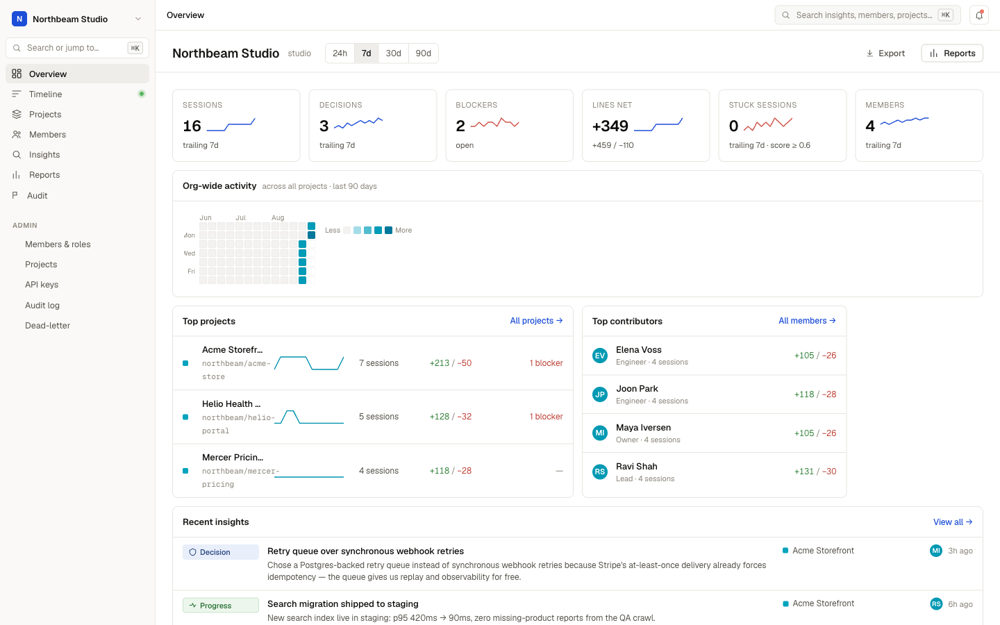
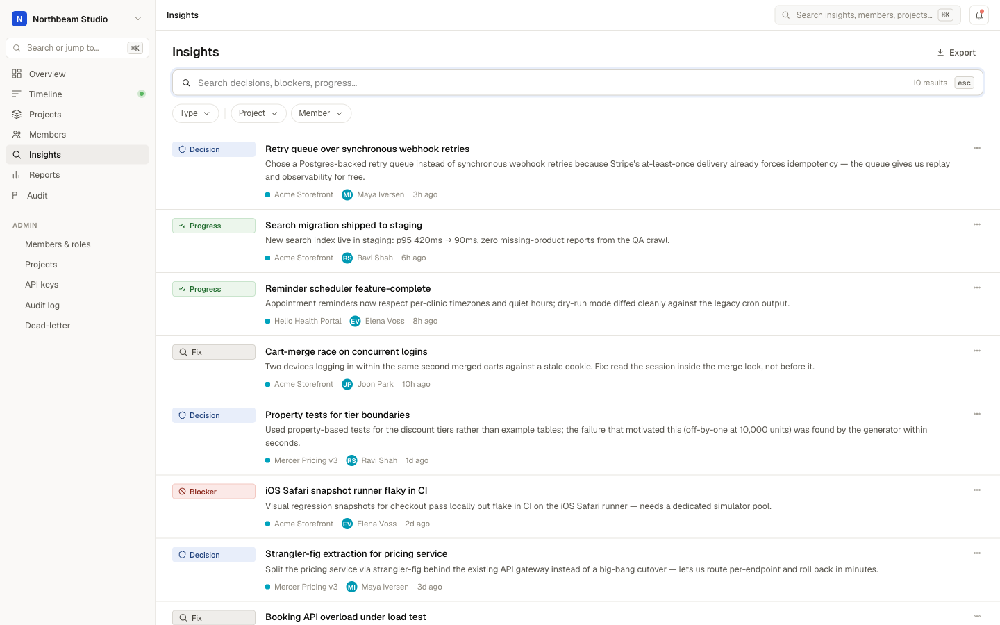
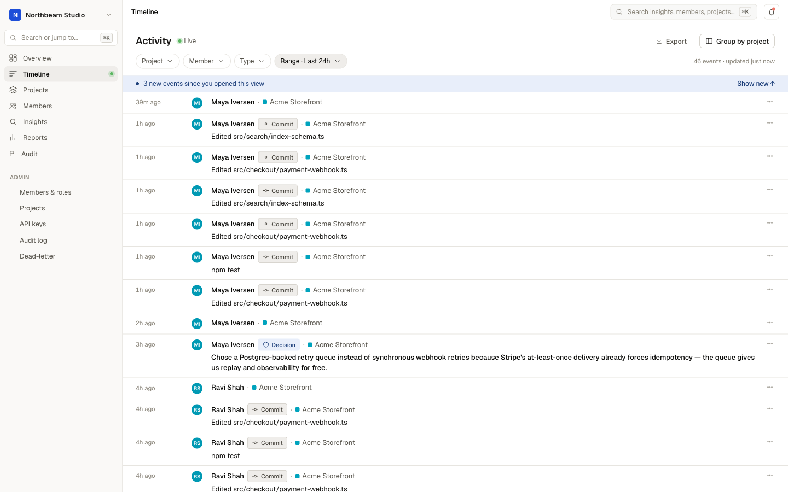
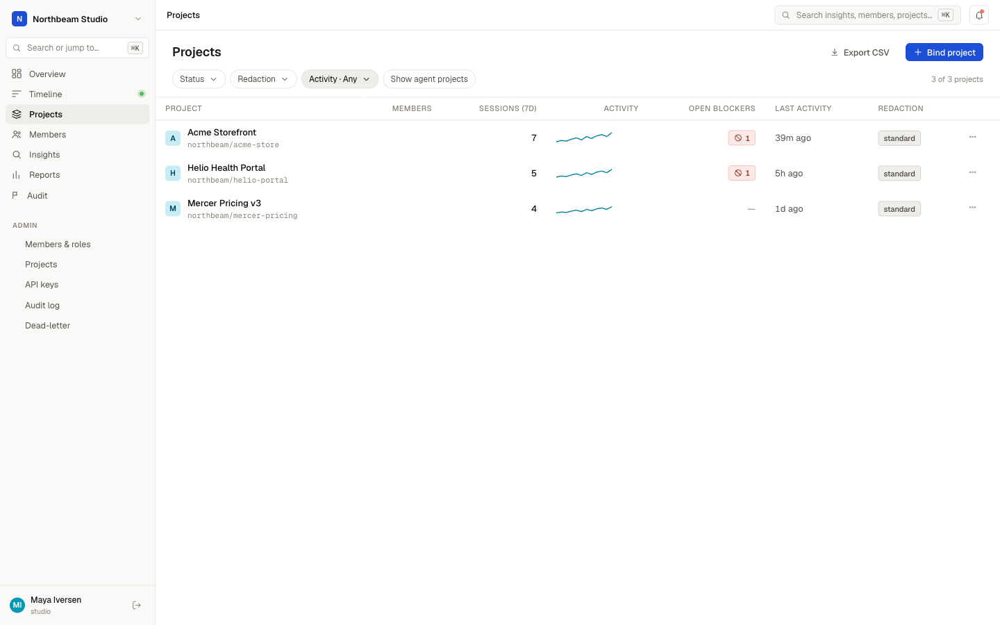

# Code Pulse

Self-hosted middleware that turns each developer's [Claude Code](https://claude.com/claude-code)
sessions into shared, queryable team knowledge — and feeds that knowledge back
into every team member's next AI session as context.

Every session start injects your team's recent decisions, open blockers, and
hot files into Claude's context. Every session end captures a structured
summary. A dashboard shows who's working on what, where people are stuck, and
what was decided — across every repo your team touches.

> **Status:** beta. Capture, ingest, insights, context injection, dashboard,
> and admin all work end-to-end. Expect rough edges; see the issue tracker.
>
> Not affiliated with or endorsed by Anthropic. "Claude" is a trademark of
> Anthropic, PBC.

## What it looks like

*All screenshots show a seeded demo org with fictional data.*

**Team overview** — sessions, decisions, open blockers, and line churn across every project, with an org-wide activity heatmap:



**Insights** — every decision, blocker, fix, and progress note captured from sessions, searchable and filterable:



**Live timeline** — who is doing what right now, across all repos:



**Projects** — auto-discovered from each session's repo, with activity sparklines and open-blocker counts:



## How it works

```
Claude Code hooks ─▶ SQLite outbox ─▶ sync ─▶ API (Hono + Postgres)
      ▲                                          │
      └── SessionStart context injection ◀───────┘
                                                 └─▶ team dashboard (Next.js)
```

- **Hook** (`packages/hook`) — bash + jq + sqlite3, fires on Claude Code's
  SessionStart / PostToolUse / Stop / SessionEnd. Never blocks, never breaks a
  session; events queue locally and sync in the background.
- **API** (`apps/api`) — Node 22, Hono, Drizzle, Postgres 16. Idempotent
  batched ingest, server-side redaction (always-on secret masking +
  sensitive-file body drop), typed insight derivation, org/member/project
  admin, retention, export.
- **Dashboard** (`src/app/team`) — Next.js 16. Timeline, projects, sessions,
  insights search, reports, admin.

## Privacy & consent

The hook shows a one-time notice on first use and can be stopped at any time:
`code-pulse pause`, `CODE_PULSE_DISABLED=1`, or
`{"disabled": true}` in a repo's `.code-pulse.json`.
Secrets (API keys, tokens, private keys, credentialed URLs) are masked before
storage, and the content of sensitive files (`.env*`, `*.pem`, `id_rsa*`, …)
never leaves the developer's machine. Per-org retention, full JSONL export,
and member/org data deletion are built in. `code-pulse uninstall`
removes everything.

## Quickstart (self-hosted, ~10 minutes)

Prereqs: Node 22+, Docker, and on each developer machine `jq` + `sqlite3`.
Supported: macOS and Linux. Windows: WSL only (untested natively).
Built against Claude Code 2.x hooks (`SessionEnd` requires 2.x).

```bash
git clone https://github.com/Clemens865/Code-Pulse.git && cd Code-Pulse

# 1. API + database
cd apps/api
docker compose up -d                  # Postgres 16 on :56432
cp .env.example .env                  # then fill in the generated secrets —
                                      # see apps/api/README.md for one-liners
npm install
npm run db:migrate                    # applies all migrations, tracked in _migrations
npm run bootstrap -- --org "Your Team" --email you@example.com
#    → prints ORG_ID / MEMBER_ID (dashboard sign-in) and your API key (shown once)
npm run dev                           # API on :8787

# 2. Dashboard (new shell, repo root)
npm install && npm run dev            # :3142 — sign in with the identity you bootstrapped

# 3. Each developer's workstation
npm install -g @code-pulse/hook   # or from a checkout: npm install -g ./packages/hook
code-pulse init --api-url http://<api-host>:8787 --api-key <their key>
code-pulse doctor              # verify end-to-end
```

Admins invite teammates (each gets their own API key) from **Admin → Members**.

Deploying for real: set `NODE_ENV=production` and either put the API behind
your own auth proxy with `LOCAL_LOGIN=true`, or keep it on a trusted network.
`docs/team-saas/STACK.md` describes one hosted topology (Fly/Neon/Vercel) if
you want a managed setup.

## Repo layout

```
src/app/team/        team dashboard (Next.js App Router)
apps/api/            ingest + read API (Hono) — see apps/api/README.md
packages/hook/       workstation hook + sync CLI (code-pulse)
docs/                product, capture-layer, metrics, compliance docs
```

## CLI reference

```
code-pulse init --api-url URL --api-key KEY   install the hook
code-pulse sync [--requeue-quarantined]       drain the outbox now
code-pulse doctor                             health checks
code-pulse pause | resume                     stop/start capture
code-pulse agent install|uninstall|status     background sync daemon
code-pulse uninstall [--purge]                remove everything
```

## License

MIT — see [LICENSE](./LICENSE).
